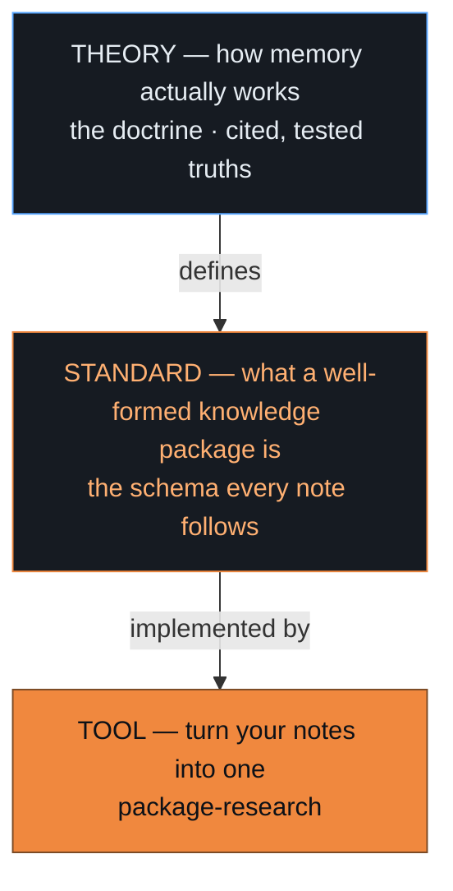

# The Memory Doctrine

**A theory of how memory works — turned into a standard for knowledge, turned into a tool that packages it. All open, so improving any layer improves them all.**

`open · CC BY 4.0`

<!-- ▶ DROP VIDEO: drag memory-doctrine-summary.mp4 onto the line below in GitHub's web editor; it becomes a video player. Then delete this comment and the placeholder line. -->
**▶ Overview video placeholder** — drag-and-drop `memory-doctrine-summary.mp4` here (~32s).



All three layers are in this repo:

- **The theory** → [`axioms/`](axioms) + [`clusters/`](clusters) — the cited truths, in seven themes.
- **The standard** → [`scripts/doctrine_lint.py`](scripts/doctrine_lint.py) — the checker every package must pass.
- **The tool** → [`tools/package-research`](tools/package-research) — turns your notes into a conformant package.
- **The open edges** → [`OPEN-QUESTIONS.md`](OPEN-QUESTIONS.md) — what the standard hasn't settled yet.

## The problem

Every AI agent has memory — a vector store, a retrieval pipeline, a "memory" feature. But each of those is only the bottom layer: an implementation with no shared, evidence-based account of what memory *is* or what makes it good. So teams rebuild the same intuitions, benchmark by benchmark.

The Memory Doctrine covers all three layers — a theory, the standard that follows from it, and a tool that runs on both. The theory defines the standard; the standard defines what the tool must produce.

---

## 1 · The theory — how memory actually works

<!-- ▶ DROP VIDEO: drag memory-doctrine-theory.mp4 onto the line below in GitHub's web editor; it becomes a video player. Then delete this comment and the placeholder line. -->
**▶ Theory video placeholder** — drag-and-drop `memory-doctrine-theory.mp4` here (45s).

> **Memory is a network of generative, confidence-weighted truths** — a graph of ideas where the value lives in the *connections*, each idea carries an *earned* degree of belief, and a few load-bearing ideas *generate* the rest.

Distilled from research across psychology, neuroscience, information theory, AI, and epistemology into **23 cited axioms in seven themes** (the *confidence* in parentheses is how well-evidenced each is, 0–1):

| Theme | The question | The load-bearing finding |
|---|---|---|
| **Structure** | How is knowledge shaped? | Value lives in the **connections, not the nodes** — a note's retrieval budget is finite and splits *logarithmically* across its links, so a junk link measurably dilutes recall of the rest *(0.90)*. One idea per note. |
| **Retrieval** | How is it recalled? | Remembering is **cue-based pattern completion** — and in its formal form, the modern Hopfield update and transformer attention are the same equation *(0.95)*. Recall needs a **sparse index that completes into a rich store** — never merged *(0.92)*. |
| **Truth** | How sure, and how do we know? | **Confidence is earned by evidence** *(0.92)* — and it is *not* truth: in any gist-based store, confidently-false memories are a normal, priced outcome *(0.92)*. Sureness, importance, and recall are **three different things, never collapsed** *(0.93)*. |
| **Dynamics** | How does it change? | You lose the **path, not the belief** — recall fades; confidence doesn't *(0.92)*. Memory re-opens for writing **only under surprise** *(0.85)*. |
| **Method** | How do you build and check it? | Knowledge distills in **bounded layers** — the generative idea on top, elaboration and evidence beneath *(0.93)*. A belief locks only after an **adversarial challenge + a citation check** *(0.93)*. |
| **Meta** | What does it know about itself? | The deep unifications: prediction error is **one quantity behind learning, salience, and belief-revision** — the *Surprise Principle* *(0.88)*; and the geometry of retrieval and the index/store split are **structurally one object — a cognitive map** *(0.83)*. |
| **Prospective** | How does it remember to *act*? | Bind reminders to **things you'll naturally pass by**, not a polling loop *(0.82)*; an open intention stays active and must be *switched off* on completion, not just flagged done *(0.74)*. |

Three results worth pulling out:

- **Retrieval is associative.** An embedding store behaves as an associative memory — so the geometry of your vectors is the structure of your memory.
- **Confidence isn't truth.** Mistaking "feels fluent" for "is true" is the shared root of human false memory *and* AI hallucination — so confidence must be earned, scored, and kept apart from recall.
- **Surprise is the write signal.** Memory updates on the gap between expected and actual.

**Built adversarially, scored honestly.** Every axiom is confidence-scored and cited to primary research; the set survived three independent red-team rounds and a full-text citation purge, and the errors that caught are reported, not hidden. The weakest planks (scored 0.74 and 0.82) are flagged provisional. The full argument and rigor trail are in the project's thesis — *being prepared for this repo*.

---

## 2 · The standard — what a well-formed knowledge package is

<!-- ▶ DROP VIDEO: drag memory-doctrine-standard.mp4 onto the line below in GitHub's web editor; it becomes a video player. Then delete this comment and the placeholder line. -->
**▶ Standard video placeholder** — drag-and-drop `memory-doctrine-standard.mp4` here (~48s).

The theory doesn't just describe memory; it determines what a unit of knowledge should look like. Every rule of the standard traces to a finding above — nothing here is arbitrary:

| A knowledge package must… | …because the theory says | …which on disk means |
|---|---|---|
| hold **one idea per note** | knowledge is atomic and composable | each axiom note is self-contained |
| be a **thin index over a rich store** | recall splits the index from the store | `axioms/` point into `evidence/` — never merged |
| **score each idea's confidence**, from evidence | confidence must be earned | `confidence: 0–1`, backed by its cited evidence |
| keep **sureness, importance, recall separate** | they are three different orderings | distinct fields — never one "importance" number |
| use **typed, weighted links** | value is in fan-budgeted edges | `relations:` with typed edges |
| be **distilled in layers** | knowledge layers from generator to evidence | generator on top, elaboration, evidence beneath |
| **lock only after an adversarial challenge** | beliefs survive refutation first | `status: candidate → locked` |
| **carry its own revision rules** | memory revises on new evidence | `contradicts` edges + append-only evidence |

So one idea is one Markdown note with a structured header — the standard *is* a file format:

```yaml
id: B4-index-store-split
type: axiom
cluster: B-retrieval
statement: "A sparse index pattern-completes into a rich store — never merge them…"
generativity: 5          # how much else derives from it
confidence: 0.92         # earned from the cited evidence, not from how it sounds
status: locked           # survived an adversarial challenge
relations:
  supports: [B1-spreading-activation]
  contradicts: []
evidence: [teyler-discenna-1986, mcclelland-1995]   # → into the rich store
```

**A checker verifies it.** A small script ([`scripts/doctrine_lint.py`](scripts/doctrine_lint.py)) checks every rule above: confidence values in range, each axiom cites evidence that actually exists, every link points to a real note, and every evidence note records its source and the date it was checked. The package also passes the package manager's own structural check (`kpm doctor`). A package that fails these checks isn't valid.

**The doctrine follows its own rules.** This repository is itself a package built to the standard — 23 axiom notes indexing 41 evidence notes, each scored and linked, passing the checker. If the rules couldn't be met, the doctrine couldn't have been written to them.

---

## 3 · The tool — turning notes into a package

<!-- ▶ DROP VIDEO: drag memory-doctrine-tool.mp4 onto the line below in GitHub's web editor; it becomes a video player. Then delete this comment and the placeholder line. -->
**▶ Tool video placeholder** — drag-and-drop `memory-doctrine-tool.mp4` here (~50s).

[`package-research`](tools/package-research) takes a folder of raw notes — research, transcripts, scratch files — and produces a package that passes the checker. It runs the doctrine's method as a pipeline:


1. **Read** the notes and split them into passages, each tagged with where it came from.
2. **Distill** the few load-bearing ideas out of the passages.
3. **Score** each idea's confidence from the evidence actually present — not from how it reads.
4. **Verify** by trying to refute each idea and checking it cites a real source; unsupported ones are dropped.
5. **Split** what survives into a thin index and a rich evidence store, cross-linked.
6. **Write and check** the package — run the linter and `kpm doctor`.

It runs two ways:

- **With an API key**, a model does the distilling, scoring, and verifying.
- **Keyless** — an AI assistant you're already working with does that judgment, and the tool handles the structuring and the checks. Either way the output passes the same gates.

```bash
cd tools/package-research && pip install -e .
package-research run ./my-notes --out ./my-kpm
```

The judgment steps — which ideas, how confident — vary with the model or agent; the structure and the checks don't, so the result is always a valid package even when the thinking varies. There are example input notes in [`tools/package-research/examples`](tools/package-research/examples), and the internals are documented in [`ARCHITECTURE.md`](tools/package-research/ARCHITECTURE.md).

**One honest boundary.** It checks that each idea cites a real passage *from your notes* — it doesn't fact-check against the open web. And it organizes notes you already have; researching a topic from scratch is a separate, larger job.

---

## Open by design — improve one, improve all

The three layers are tied together *and* open (CC BY 4.0), so a win anywhere propagates:

- **Challenge an axiom** → the theory sharpens → the standard it defines sharpens → the tool produces better packages.
- **Improve the tool** → it stress-tests the standard → which feeds back into the theory.

Most memory systems are a closed bottom layer. Here all three are open, so a correction anywhere propagates: challenge a claim and the standard it defines tightens; improve the tool and it stress-tests the standard.

## Challenge it

This doctrine is **made to be argued with.** Open an issue titled `challenge: <idea>` with a real citation, and a well-supported objection will lower an idea's confidence, narrow it, or retire it. See **[CONTRIBUTING.md](CONTRIBUTING.md)** — and **[OPEN-QUESTIONS.md](OPEN-QUESTIONS.md)** for the gaps the standard hasn't settled yet.

*Licensed [CC BY 4.0](LICENSE) — adapt and improve freely, with attribution.*
