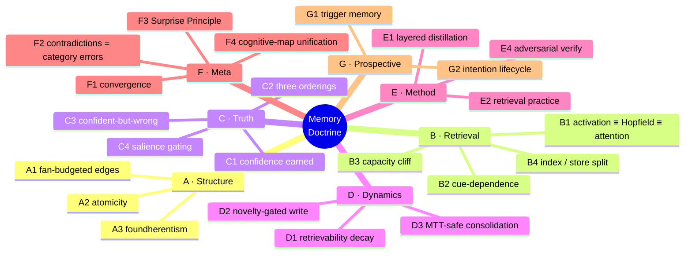
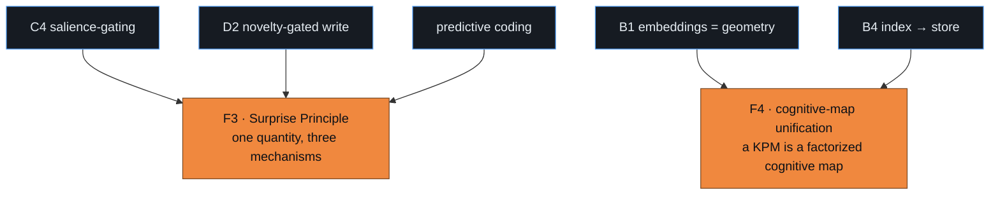
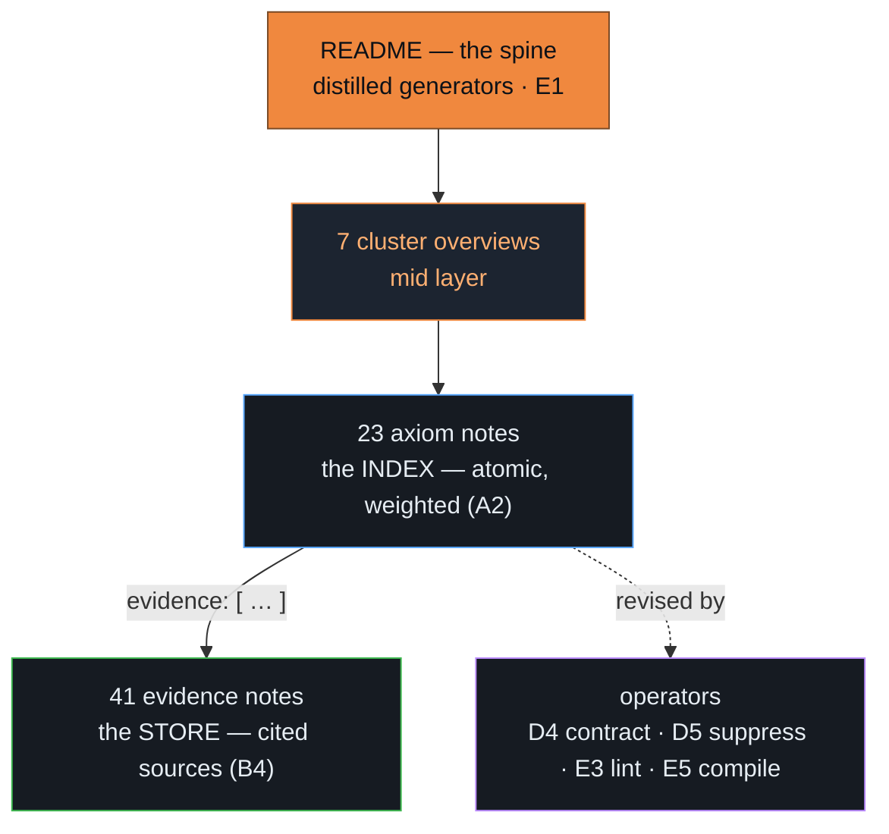

# The Memory Doctrine

*A retrieval-optimized, confidence-weighted axiom-set for how knowledge should be shaped, stored, recalled, and revised.*

**23 axioms · 41 cited sources · 4 operators · 7 clusters · adversarially red-teamed · passes `kpm doctor` · [CC BY 4.0](LICENSE)**

<!-- For an inline autoplay player: edit this file on github.com, drag-drop assets/../memory-doctrine-explainer.mp4 into the editor, and replace the poster line below with the github.com/user-attachments/... URL it produces. -->
[](https://github.com/SolanaFox2/memory-doctrine/releases/download/v1.1.0/memory-doctrine-explainer.mp4)

> ▶ **[Watch the full explainer](https://github.com/SolanaFox2/memory-doctrine/releases/download/v1.1.0/memory-doctrine-explainer.mp4)** (~3 min, silent) — the research, a tour of all seven clusters, the four core insights *explained*, and what we propose.

## Why this exists

Agent memory is everywhere and agreed on nowhere. Mem0, Letta, Zep, MemGPT, every RAG stack — each ships a memory system, but almost none rests on a shared, cited account of *what memory is*. The result is a fast-moving field built on intuition and benchmark-chasing, with no common theory to build against or argue from.

The Memory Doctrine is that missing layer: a vendor-neutral, evidence-gated set of **fundamental truths** about memory — distilled from 17 research domains, every one cited and adversarially reviewed. It's small enough to read, structured so tools can consume it, and open (CC BY 4.0) so anyone can adopt it, fork it for their own domain, or try to break it. *The faster it's challenged, the better it gets.*

## Install

```bash
kpm add github:SolanaFox2/memory-doctrine#v1.1.0
```

## How memory works — the doctrine in five ideas

You don't have to read 23 axiom files to get the core. Here is the whole picture:

1. **It's a network, and the edges are the point.** A fact's meaning is its pattern of connections — value lives in the *edges and retrieval paths*, not the nodes. Each connection spends from a finite per-node budget (the *fan law*), so good memory curates its links instead of hoarding them.

2. **Recall is reconstruction, not lookup.** Retrieval is *pattern completion* from a cue — and it is mathematically identical to the attention mechanism in transformers (spreading activation ≡ modern Hopfield networks ≡ attention). An embedding store *is* an associative memory.

3. **"Sure," "true," and "easy to recall" are three different things.** Confidence must be *earned by evidence* — never inferred from fluency or repetition — and kept on a separate axis from how *foundational* a belief is and how *easily* it comes to mind. Collapse those axes and you get the confident-but-wrong failure mode — the root of both hallucination and human false memory.

4. **You forget by losing the path, not the belief — and surprise is the write signal.** Retrievability fades with disuse and interference while the belief itself persists. What tells memory to write something *new* is *prediction error* — surprise. Large surprise → mint a new node; moderate → reconsolidate; none → leave it. Crucially: don't overwrite on surprise, *branch*.

5. **To package knowledge, distill the generators.** Keep the few truths that *generate* the rest, cite them, split a thin index from a rich store, verify adversarially, and mint-don't-overwrite on surprise. That is a Knowledge Package (KPM) — and this doctrine is the rubric for building one.

## The model

Memory is a retrieval-optimized network of confidence-weighted *generative* truths. A KPM is the portable, distilled form of that network for a domain: it ships the irreducible generators of the domain's knowledge (not elaborations, not summaries), scored with earned evidential confidence, split into a sparse axiom index and a rich evidence store, and packaged with the operators needed to revise it. Because the generators transfer, the KPM transfers; because the confidence is evidence-gated, the KPM is auditable.

## What's inside — the seven clusters

The 23 axioms are organized into seven clusters. Each answers one question about memory and carries a headline truth:

| Cluster | The question it answers | A headline truth |
|---|---|---|
| **[A · Structure](clusters/A-structure.md)** | How is knowledge shaped? | Value is in the weighted edges, not the nodes (the fan law) |
| **[B · Retrieval](clusters/B-retrieval.md)** | How is it recalled? | Retrieval = pattern completion; spreading activation ≡ Hopfield ≡ attention |
| **[C · Truth](clusters/C-truth.md)** | How sure — and how do we know? | Confidence is *earned* by evidence, on its own axis (three orderings, never collapsed) |
| **[D · Dynamics](clusters/D-dynamics.md)** | How does it change over time? | You forget by losing access, not the belief; surprise gates new writes |
| **[E · Method](clusters/E-method.md)** | How do you build & validate it? | Distill generators in layers; verify adversarially before locking |
| **[F · Meta](clusters/F-meta.md)** | What does it know about itself? | Prediction error is one quantity doing three jobs; a KPM is a factorized cognitive map |
| **[G · Prospective](clusters/G-prospective.md)** | How do agents remember to *act*? | Bind triggers to nodes you already traverse; inhibit completed intentions |

Every axiom is its own atomic note in [`axioms/`](axioms) — a confidence score, a generativity score, typed links to the axioms it derives from or supports, and citations into the [`evidence/`](evidence) store.



## Two unifications worth the price of admission

The doctrine earns its keep where it *collapses* things people treat as separate:

- **The Surprise Principle (F3)** — salience-gating, novelty-gated writes, and predictive coding are not three mechanisms; they are *one quantity* — prediction error — observed at three levels (behavioral, dopaminergic, cortical).
- **The cognitive-map unification (F4)** — embeddings-as-geometry (B1) and the sparse-index→rich-store (B4) are the *same object*: a cognitive map. A KPM is structurally a factorized cognitive map, which is *why* its generators transfer.



## Operators (the productions)

A portable KPM ships axioms *and* the rules to revise them — the operators are its procedural memory.

- **[D4 · Contract](operators/D4-contract.md)** — on contradiction, minimally shrink the belief set per AGM; never delete evidence
- **[D5 · Suppress](operators/D5-suppress.md)** — lower a belief's retrievability without touching its confidence or evidence; reversible, auditable
- **[E3 · Lint](operators/E3-lint.md)** — mechanical pre-lock gate: atomicity, evidence presence, frontmatter-body sync, F2 invariant
- **[E5 · Compile](operators/E5-compile.md)** — on impasse, distill the resolution path into a candidate new generator; must pass E4 before ignition

## How this package is built

The structure is self-exemplifying. The 23 atomic axiom notes *are* the index (B4's sparse index layer); the 41 evidence notes *are* the store (B4's rich content layer); this README is the distilled spine (E1's generator layer sitting above the elaboration). The lint gate runs automatically: `scripts/doctrine_lint.py` (0 violations). Every promoted axiom has been adversarially challenged and independently grounded (E4). Confidence fields are set from evidence, never from retrieval frequency or fluency (C1).



## How to use it

This doctrine is the rubric a knowledge-packaging skill or agent builds against when turning raw notes, research, or experience into a portable knowledge package:


1. **Distill generators, not notes** (E1) — find the irreducible source; don't transcribe elaborations.
2. **Score confidence from evidence** (C1) — check citations; never infer from fluency or recency.
3. **Split index from store** (B4) — KPM = index; research files = store; retrieval completes the join.
4. **Verify before locking** (E4) — run lint (E3) then adversarial challenge; Gettier risk is real.
5. **Mint, don't overwrite, on surprise** (the Surprise Principle, [F3](axioms/F3-surprise-principle.md)) — large prediction error → new node, not in-place edit.

## How it was built (why you can trust it)

Every axiom here was *earned, not asserted*. The doctrine was synthesized from primary sources across **17 research domains** — cognitive psychology, neuroscience, reinforcement learning, information theory, epistemology, personal knowledge management, AI memory systems, cognitive architectures, and more — then put through **three independent adversarial red-team rounds** and a **full-text citation audit**. That audit caught a hallucinated author and a missing axiom *before* release. Confidence scores come from the evidence, never from how good a claim sounds. **23 of 23 axioms are cited**, and `scripts/doctrine_lint.py` enforces it on every change.

## Challenge it

This doctrine is **defeasible by design** — every axiom is confidence-weighted and built to improve from attack. See **[CONTRIBUTING.md](CONTRIBUTING.md)**: open a `challenge: <axiom-id>` issue with a real citation, and a well-supported refutation will lower an axiom's confidence, re-scope it, or retire it. The fastest way to make the doctrine better is to try to break it.
